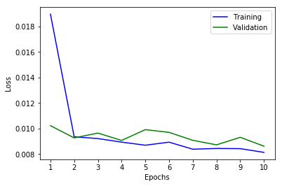

# **Behavioral Cloning** 

The goals / steps of this project are the following:

* Use the simulator to collect data of good driving behavior
* Build, a convolution neural network in Keras that predicts steering angles from images
* Train and validate the model with a training and validation set
* Test that the model successfully drives around track one without leaving the road
* Summarize the results with a written report

## Rubric Points
### Here I will consider the [rubric points](https://review.udacity.com/#!/rubrics/432/view) individually and describe how I addressed each point in my implementation.  

---
### Files Submitted & Code Quality

#### 1. Submission includes all required files and can be used to run the simulator in autonomous mode

My project includes the following relevant files (the rest of the files are not required for the submission):


* **README.md**: explaining what this repository is about.
* **writeup_report.md**: summarizing the results.
* **Videos/x.mp4**: this is the behavior of the car with the included model.
* **Explore dataset + Experimental setup.ipynb**: preparing the dataset with the correct format. Also contains how to split in train and validation set.
* **model.ipynb**: contains the code to create and train the model
* **data_augmentation** _**toolkit.py**: a set of useful tools to perform data augmentation on images.
* **drive_new.py**: for driving the car in autonomous mode.
* **Trained_model/model.h5.tar.gz-0x**: contains a trained convolution neural network.


#### 2. Submission includes functional code
Using the Udacity provided simulator and my drive.py file, the car can be driven autonomously around the track by executing:

```bash

cat model.h5.tar.gz-0* > model.tar.gz

tar -zxvf model.tar.gz

python drive_new.py model.09-0.009.h5

```

#### 3. Submission code is usable and readable

model.ipynb file contains the code for training and saving the convolution neural network. The file shows the pipeline I used for training and validating the model, and it contains comments to explain how the code works.

### Model Architecture and Training Strategy

#### 1. An appropriate model architecture has been employed

My model follows the Nvidia architecture defined in the paper "End to End Learning for Self-Driving Cars". However I was not able to find which activation function they use (-3 points for non-reproducibility) so I chose ReLU, which seems a standard one these days and gave me good performance in other projects. 

There is a slightly change in the architecture as I did not include a normalization process in the net (but outside). I don't really think there is a great increase in performance for doing those computations in the GPU. I mean, I think the increase will be tiny and doesn't pay off, specially using Keras' generator which use CPU concurrently with GPU. The great advantage could be transforming uint8 images into float32 ones inside the net, this way, we can reduce the always present bottleneck between CPU and GPU by sending smaller images (in bytes).

About the architecture.. well. I don't like strides greater than one as I read they are more destructive than max pooling layers but, I worked for Nvidia guys, so I decided to give it a try.


#### 2. Attempts to reduce overfitting in the model

I dealt with overfitting problem in two ways: getting a lot of data and an agressive data augmentation.

In order to make my model to generalize better I run my car for more than 4 laps. Also I get helped from my broter and he drove the car too, so I could add different driving styles which add variety in the data and make the model more robust.

Always, always, always you need more data. I read some years ago that if you want to learn Deep Learning, you need to learn first how to generate more data. That's why I created a data augmentation toolkit. It contains 10 different transformations called: rotateImage, shift, bilateral_filter, salt_and_pepper, speckle_noise, horizontal_flipping, random_light, random_shadow, histogram_equalization, pseudo_shift.

I created a stochastic approach for applying data augmentation based on each class probability appearance. Yeah, I said class (despite this is a regression problem), the reason for that will be explained in the [Creation of the Training Set & Training Process](#Creation-of-the-Training-Set-&-Training-Process) section. The method consisted on creating equally-spaced thresholds for splitting the data in 20 bins.

The following is the original distribution per class:

 
<a name="Original-images-per-class"/></a>

And this one is the result of executing 100 times the training generator with the data augmentation enabled:


Despite this stochastic approach seems to be not working as expected (almost a flat distribution), it is converting the original unusable distribution into something that now can be used for training a model. Those two peaks that can be appreciated are produced by a technique to artificially generate recovery data in which the images are "shifted" and the angle is added a coefficient of +- 0.2


#### 3. Model parameter tuning

The optimizer used is an Adam optimizer with the default learning rate, which seems to be an standard optimizers nowadays. Also because I wanted to avoid standard gradient descent as it is very "simple" and it is explicitly not recommended by Andrew Ng in his Machine Learning course (I remember he said it is perfect for education, to teach the concept but in practice there are better options).

It was applied a learning rate scheduler based on validation loss: if the loss didn't improve for more than 3 epochs, the learning rate will be reduced by a factor of 2.

The number of epochs used is 10. However, the model was saved every epoch in case is needed to use any non-final version.

Batch size was set to 64 as it was a value I found good enough in other exercises and after plotting the training and validation loss versus epochs seems that was not needed to change.




#### 4. Creation of the Training Set & Training Process
<a name="Creation-of-the-Training-Set-&-Training-Process"/></a>

Before a suggestion was included in the Udacity classroom about how to do the splits, two approaches were hanging around my head:

* As the validation set must contains no data included in the training set, I though of using K-means algorithm with visual features in order to divide the whole image set into different clusters. The intuition behind this idea was that images from the same part of the circuit will fall in the same cluster, thus, I can choose a cluster with a size around 20-30% with contains images from a specific part of the track and keep it from the training set. However, while this seemed a very interesting idea, a flaw was found: why if that cluster is a straight path and only contains near to 0º angles? Or maybe is a curve and doesn't contain any information about how to drive straight ahead. That's the momment when the second idea came.
* This idea consisted on converting the regression problem into a classification problem just for the sake of splitting the data. The hole dataset was digitized using 20 intervals, and was ensured that 20% of each class was set appart for validation.

Posterior to creating my dataset, the Udacity classroom was updated with some tips on how to do the splitting: "Be sure to randomly shuffle the data before splitting into training and validation sets." But I have to say that it is really a poor idea. The distribution of the data must remains the same in both splits. If you train only with data included in the near to 0º category, if will perform really bad when you do the inference on the validation set that contains only curves (this situation can happen with a random split).

Note: only data from track 1 was used for training and validation.

#### 5. Appropriate training data

After training the first model I saw that my car was waving too much. It was unable to do a complete lap: as soon as the car saw the water, it jumped directly to it. Not enough recovery data? Wrong hyperparameters to the model?. 

I decided to create a video with the dataset so I can quickly inspect all the images (around 52.000). That is how I found that the dataset hadn't the expected quality. Was full of images of my first attempt to dominate the simulator -> full of images crashing with trees, getting outside the path and even driving underwater (yes, it is possible). So I spend some time removing the half of those mistaken images: the half that I was going outside the path, but keeping the half of them where I was coming back to the path, so my car learnt how to recover to the center.


#### 6. Results

This is the first attempt on track 1:

<a href="http://www.youtube.com/watch?feature=player_embedded&v=wxN3t6eehYg
" target="_blank"></a>

The final result on track 1 is here:

<a href="http://www.youtube.com/watch?feature=player_embedded&v=fUYqfKIcU-o
" target="_blank"></a>

and this is the first attempt in track 2:

<a href="http://www.youtube.com/watch?feature=player_embedded&v=1OdWmfj987s
" target="_blank"></a>
